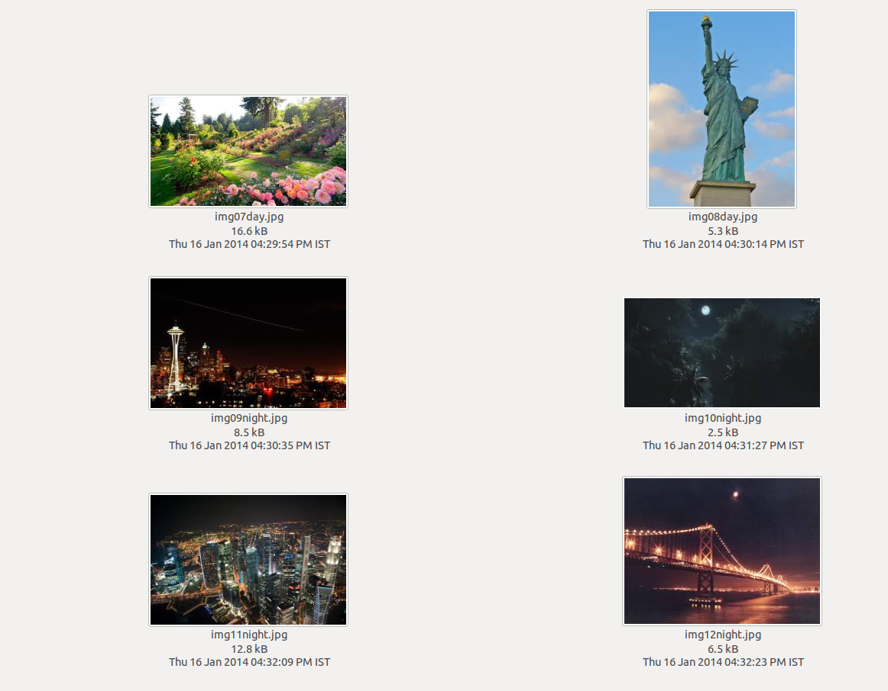
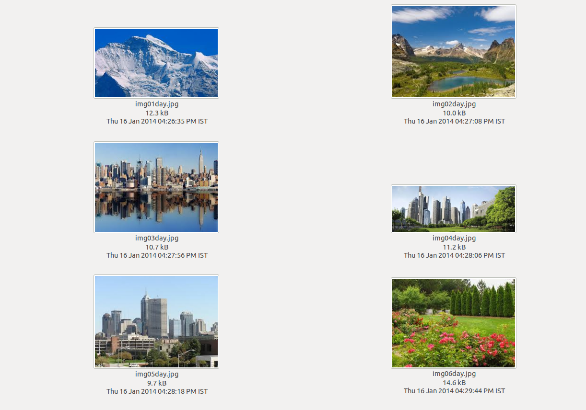

# Detect-Day-or-Night-from-Image
## Task
You need to construct a feature in a Digital Camera, which will auto-detect and suggest to the photographer whether the picture should be clicked in day or night mode, depending on whether the picture is being clicked in the daytime or at night. You only need to implement this feature for cases which are directly distinguishable to the eyes (and not fuzzy scenarios such as dawn, dusk, sunrise, sunset, overcast skies which might require more complex aperture adjustments on the camera).  

**Input Format**
A 2D Grid of pixel values will be provided (in regular text format through STDIN), which represent the pixel wise values from the images (which were originally in JPG or PNG formats).  
Each pixel will be represented by three comma separated values in the range 0 to 255 representing the **Blue, Green and Red** components respectively. There will be a space between successive pixels in the same row.  

**Input Constraints**
None of the original JPG or PNG images exceeded 20kB in size. The 2D grids of pixels representing these images will not exceed 1MB.  

**Sample Input**

This is for the purpose of explanation only. The real inputs will be much larger than this.  

0,0,200 0,0,10 10,0,0
90,90,50 90,90,10 255,255,255
100,100,88 80,80,80 15,75,255  

The above is an image represented by 3x3 pixels. For each pixel the Blue, Green and Red values are provided, separated by commas. The top left pixel has (Blue=0,Green=0,Red=200). The top-right pixel has (Blue=10,Green=0,Red=0). The bottom-right pixel has (Blue=15,Green=75,Red=255). The bottom-left pixel has (Blue=100,Green=100, Red=88).  

**Output Format**
Just one word: 'day' or 'night'. Do NOT include the single quote marks.  

**Sample Output** (Please note that the sample input shown above does not actually represent a full fledged image!)  

 day
 
**A Note on the Test Cases and Sample Tests**

The test cases have been generated from the 16 images out of which 12 have been shown in the pictures at the top. The two test cases which run as sample test cases when you compile and test, are the pictures marked as img01day.jpg and img09night.jpg respectively.
